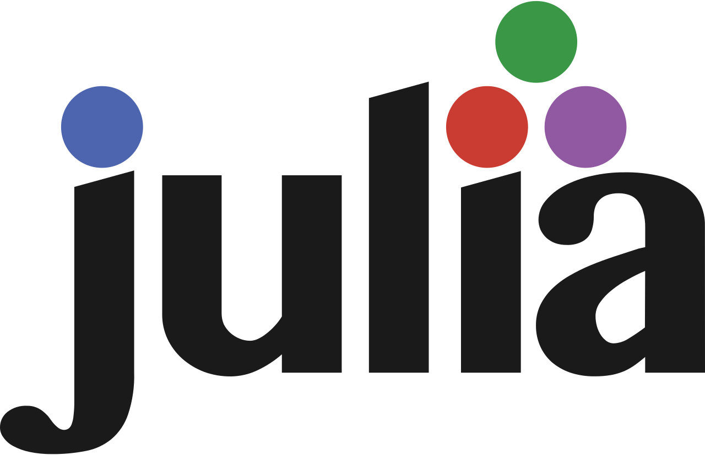
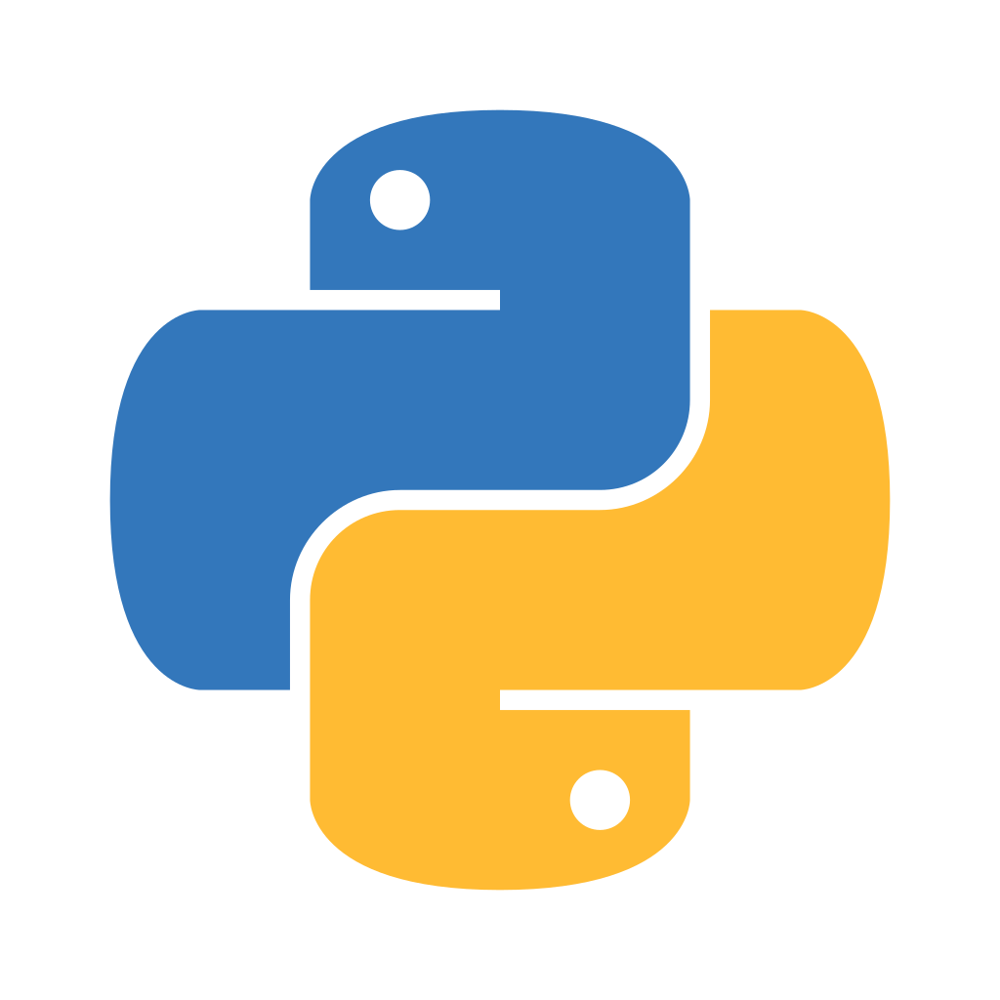
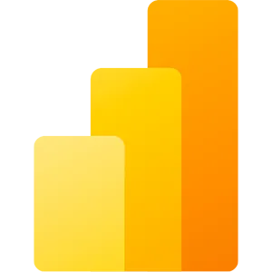
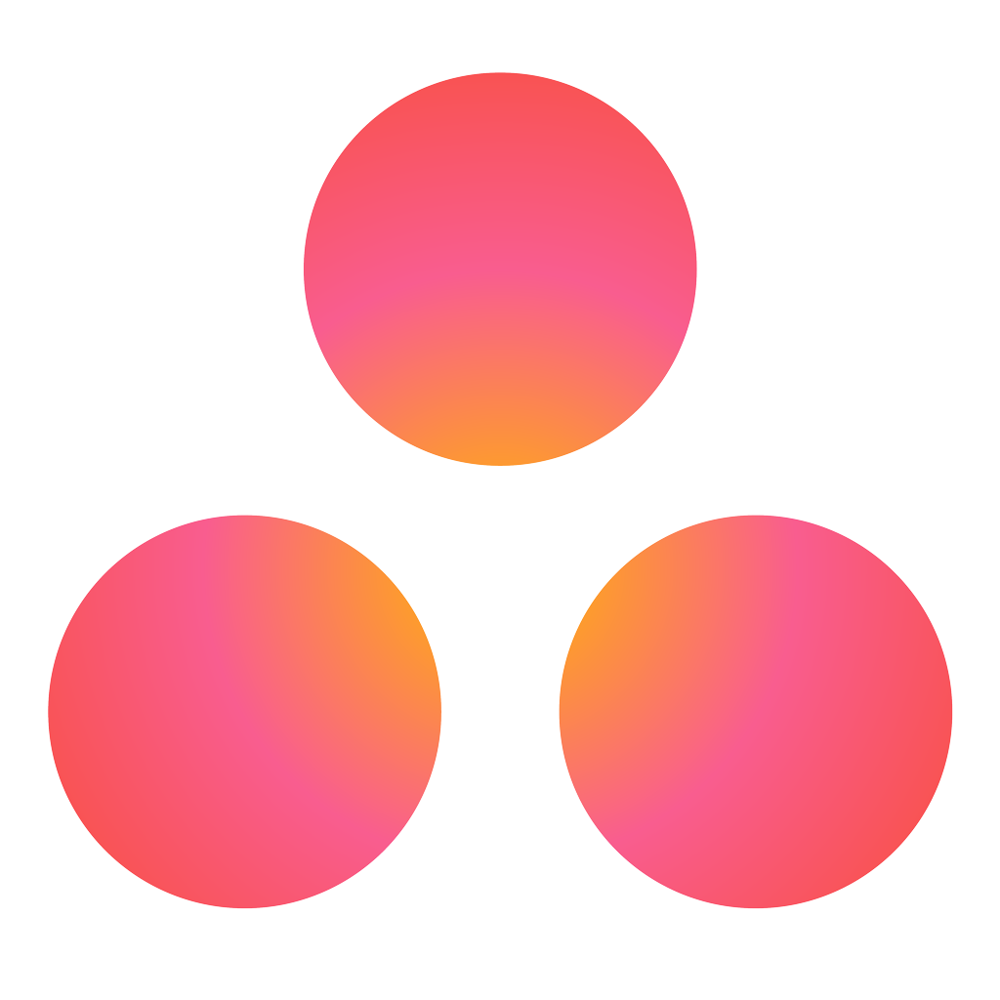
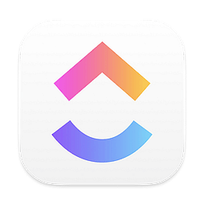

<h1 align = "center"> Hey there! ✌🏼 I'm Oscar Zepeda </h1>

    Welcome to my world! 🌎 I'm an enthusiastic student of Actuarial 🧮 and Computer Science 👾 in constant search for knowledge and technological adventures. In my day-to-day life 🩷, I enjoy exploring the convergence of technology 📱, finance 💶, and management 💼.

<section align = "center">
    
</section>

## 💻 Programming Languages
<section align = "center">
    
    
    
    
    
    
    
    
</section>

## 🔧 Software Tools
<section align = "center">
    
    
    
    
    
    
    
    
</section>

## 📈 Data Analysis
<section align = "center">
    
    
    
    
    
    
    
    
    
</section>

## 🏬 Project Management
<section align = "center">
    
    
    
    
    
</section>

## 🎨 Design
<section align = "center">
    
    
    
    
    
    
    
    
</section>

## 🌎 Linguistic Skills
- 🇲🇽 Spanish | Native proficiency
- 🇺🇸 English | Bilingual proficiency
- 🇫🇷 French | Professional working proficiency
- 🇰🇷 Korean | Limited working proficiency
- 🇧🇷 Portuguese | Limited working proficiency

## 🔗 Connect with me
<section align = "center">
    
     
    
    
</section>

## 📊 GitHub Public Stats
<section align = "center">
    <h3> Top Languages </h3>
    
    <h3> GitHub Stats </h3>
    
</section>

---

 Oscar Zepeda's Business Card 🐦‍⬛ 
